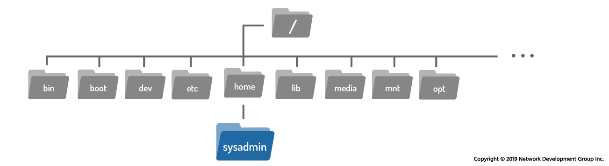

# Lista Comandi Linux
- `~` rappresenta la mia home directory. La home directory pora lo stesso nome dell'utente (att: nell'immagine l'utente si chiama sysadmin)
- `/` root directory
Tutte le volte che uso questi due simboli sto navigando con un percorso assoluto.

## File System 



## cd - Change Directory
Da utilizzare con percorsi assoluti o relativi
`cd [opzioni] [percorso]`

Spiegazione dei simboli o opzioni per i comandi:
- `.` directory corrente
- `..` directory genitore
- `~` home directory 
- `/` root directory
- `-` directory precedente

### Tipi di File 
Quando lancio il comando `ls -l` ottengo vari risultati
- drwxrwxrwx 1 root ....

Primo Carattere
- `d` = directory
- `-` = file generici
- `l` = link, puntano ad un altro file
- `s` = socket 
- `p` = pipe
- `b` = block file
- `c` = character file

Permessi `rwxrwxrwx`. Si dividono in 3 parti da 3 caratteri
- i primi 3 per lo user
- i secondi 3 per il gruppo
- i terzi per gli special 

Nomenclature
- `r` readable
- `w` writable
- `x` executable

Quando incontro un `-` vuol dire che quel particolare permesso non è disponibile per quella categoria.

Esempio: `rwxrw-r--` --> l'utente può fare tutto, il gruppo solo leggere/scrivere e non eseguire, gli special solo leggere

# Globbing (Da fare)

# Gestione File e Cartelle

## Creare un file `touch dest/nomeFile`
Posso creare più file allo stesso tempo 
`touch file1.txt file2.txt ./cartella/file3.txt`

## Creare una cartella `mkdir dest/nomeDir`
Con `mkdir -p ./Cartella/sottoCartella/sottoSottoCartella/` posso creare più cartelle una dentro l'altra in un colpo solo

## Comando Copia `cp`

```linux
cp sorgente destinazione
```

ATT: anche cp può essere un comando distruttivo poiché senza nessuna opzione sovrascrive i file di default

Per chiedere la conferma della sovrascrittura lanciare `cp -i src dest`
Per evitarla completamente lanciare `cp -n src dest`

**Copiare una cartella**
`cp -r srcFolder destFolder`


## Comando Rimuovi `rm`
```linux
rm source
```
ATT: il comando rm è un comando distruttivo, attento ad utilizzarlo

Come rimuovere una cartella
```linux
rm -r srcFolder
```


## Comando Sposta, Muovi `mv`
`mv src dest`
Può essere utilizzato anche per rinominare un file `mv src dest/nuovoNome`.
Anche in questo caso `-i` ,  `-v` , `-n` funzionano

Il `-r` non serve col il move per spostare una cartella

Esempio:
```linux
mv ./Downloads/Videos/ ./
```
